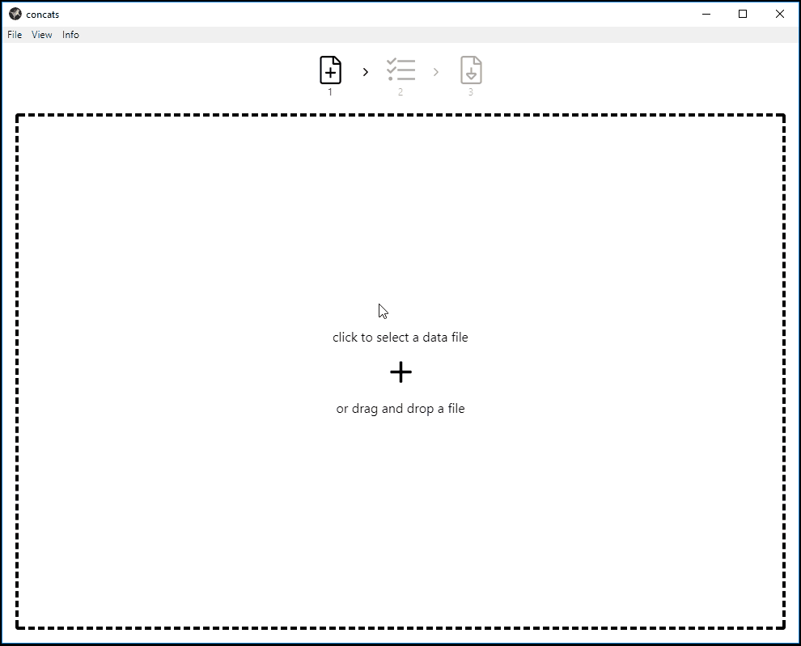

# concats

Cross platform desktop app for outputting a single-column csv file of rows of concatenated fields from an input csv file.



## Made with:

- [electron](https://github.com/electron/electron)
- [vue](https://github.com/vuejs/vue)
- [vue-cli-plugin-electron-builder](https://github.com/nklayman/vue-cli-plugin-electron-builder)

## Development

To run concats locally (_requires [Node.js](https://nodejs.org) v8.9 or above_):

```bash

git clone git@github.com/brianzelip/concats.git

cd concats

npm install

npm run electron:serve

```

## Build binaries

To build the executable binary for `$PLATFORM`, you must have [Node.js](https://nodejs.org) v8.9 or above on `$PLATFORM`, and run:

```bash
git clone git@github.com/brianzelip/concats.git

cd concats

npm install

npm run electron:build
```
